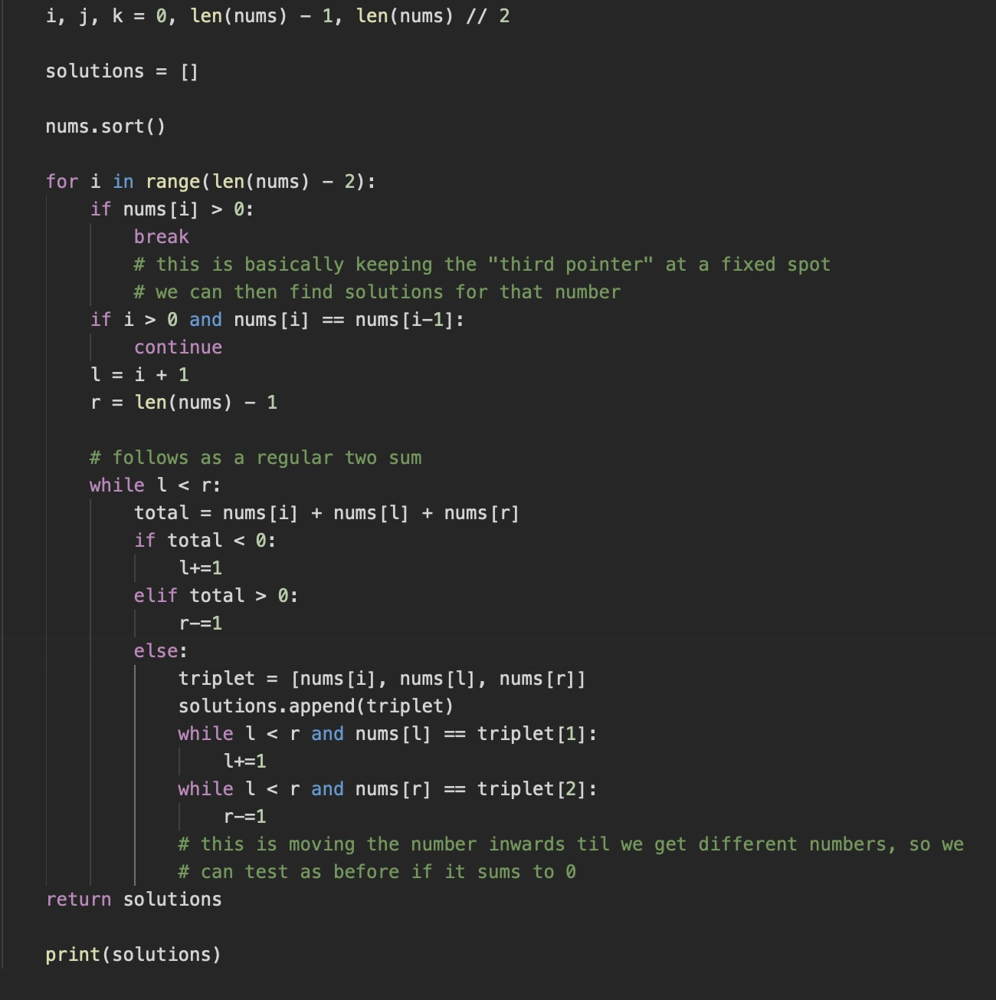

# Algorithms and Data Structures

NeetCode video to watch: https://www.youtube.com/watch?v=0K_eZGS5NsU

## Arrays & Hashing

The following section details key notes for questions based on arrays and hashing.

### Contains Duplicate - Easy

**Given an integer array nums, return true if any value appears at least twice, and return false if every element is distinct**

Initial thought process:

Create a second array of boolean values, and after checking every value in the array, if true is present in the second array, return true.

We can actually just break from the for loop when a repeat is found and return true, else if the entire for loop is completed for all iterations, return false.

Notes for future:

Main methods to solve this problem is to either sort the array into ascending order, so that we can just check neighbouring values for matches and return if identical.

Alternatively, we can utilise a hashset, where we check whether a certain value in the array exists in it, then add the value if not.

Syntax:
```
hashset = set()
hashset.add(x)
```

### Valid Anagram - Easy

**Given two strings s and t, return true if t is an anagram of s, and false otherwise.**

Initial thought process:

This is similar to the previous question, and seems to require the use of hashmaps.

Notes for future:

This uses a hashmap, to store the letters present in each of the words and the number of occurences. 


Syntax:
```
hashmap.keys() // returns a list of all keys
hashmap.values() // returns a list of all values
hashmap.items() // returns a list of all key value pairs


countS = {} // initialises hashmap
countS.get(s[i], 0) // this 'gets' the value of the key s[i] - the ith character in a string s
sorted(s) // just returning the equation of these is a valid solution

```

### Two Sum - Easy 

**Given an array of integers nums and an integer target, return indices of the two numbers such that they add up to target.**

Initial thought process:

At first I thought of using a hashmap, but then realised that it would be difficult to keep track of the indices of the numbers - considered using tuples as the key, which would have the indices of the two numbers summed.


Notes for future:

The solution is to use a one pass solution, where for each number in the array, we search for the complement, being the target minus the number. We step through each value in the list provided, and check if `target-nums[i]` is present in the hashmap, returning the index at which it is, and the index of the current number if so, otherwise we add the current number to the hashmap. This question states that the two values will definitely be present in the hashmap, so we do not need to return anything if no pairs are present.


### Group Anagrams - Medium

**Given an array of strings strs, group the anagrams together. You can return the answer in any order.**

Initial thought process:

This will use a similar ideology to the valid anagram problem, however requires you to check every value in the list/array strs. Take the algorithm from the initial solution, and wrap it in an iterator to move through each value in the list. Add the first value to a list, then compare it to each value in strs, using a set .

Notes for future:

Use the fact that the character will all be lowercase, so there are only 26 possible characters (a-z). This means we can use a hashmap called count, which stores the number of occurrences of each character in each string. Now we know that if the keys of the maps match, the strings can be made the values corresponding to the keys.

The hashmap:

```
    res =  defaultdict(list) # mapping charCount to a list of anagrams

    ord(c) # this takes the ASCII value of the character input

```

Remember that lists cannot be keys as they are mutable, so when assiging the list 'count' to a key, convert it to a tuple.

### Top K Frequent Elements - Medium

**Given an integer array nums, and an integer k, return the k most frequent elements. You may return the answer in any order.**

Initial thought process:

Use a hashmap to store the integer in the array nums as the key, and the number of occurrences as it's value. Sort the map by values (in descending order) and return the top k most frequent using a loop.

Notes for future:

Use a max heap, then pop k number of values from the heap. We use a bucket sort, and reverse the logic of the hashmap as I initally thought, where the key is used as the count, and the value is the integer that occurs *key* times. The hashmap is the same length as the input array, as that is the maximum number of times a value can occur. When constructing the output array, just iterate throught the count hashmap in reverse, in order to take the top k values.

```
    freq = [[] for i in range(len(nums) + 1)] # construct an array that is the same length as the input array, that stores an array in each index, which is a list of the integers that occur i (index) number of times.

```

### Product of Array Except Self - Medium

**Given an integer array `nums`, return an array `answer` such that `answer[i]` is equal to the product of all the elements of `nums` except `nums[i]`**

Initial thought process:

Use a hashmap, with keys being the index of the array, and the value being the product of all the values, except the index.

Notes for future:

We take the product of every value before the index chosen, and every value after it, then take their products. To do this, we make an output array, which includes the product of everything ahead of the index multiplied by the product of everything ahead of the index.

### Valid Sudoku - Medium

**Determine if a 9x9 Sudoku board is valid. Only the filled cells need to be validated**

Initial thought process:

Iterate through each row, column and 3 by 3 grid, using a hashset as we did in the *Contains Duplicate* problem.

Notes for future:

The initial thought process in this case is correct, but what we need to do is flesh out the iterative process properly. We apply indices to each 3 by 3 grid as 0, 1 and 2. We use integer division on the actual co-ordinate of each square, to find which 3 by 3 square that square lies in. We can then use said knowledge to decide whether there is a repeat in the 3 by 3 subsquare.

### Longest Consecutive Sequence - Medium

**Given an unsorted array of integers `nums`, return the length of the longest consecutive elements sequence.**

Initial thought process:

`nums = [100, 4, 200, 1, 3, 2]` -- the output for this array `nums` is 4. The problem wants us to pick out the longest consecutive sequence, which is relatively easy to understand as we've seen it before. We need to order the sequence, which can be done through the use of a hashset. If you have understood the 'Contains Duplicate' task, this seems effectively much the same with a minor extension to it.

Notes for future:

This is a little bit more different from Contains Duplicate as I though initially. We construct the set directly from the `nums` array, using `numSet = set(nums)`. Iterate through the set, and check if it is the first value in a sequence, by looking for a value one less than it. If it is the first value, set `length = 0`, and increase its' value until a number one higher than it is not found. Finally take the max of `length` and `longest`, returning the answer.

## Two Pointer

The following section details key notes for questions based on two pointer problems.

### Two Sum II - Input Array is Sorted - Medium

**Given a 1-indexed array of integers numbers that is already sorted in non-decreasing order, find two numbers such that they add up to a specific target number. Let these two numbers be numbers[index1] and numbers[index2] where 1 <= index1 < index2 < numbers.length.**

Initial thought process:

Things to note from the task:

The array is one-indexed, so we need to add one to the actual index in the array when returning our values to the user. The array has also been sorted in increasing order. We cannot discard values greater than the target in the array, as there could benegative values present. Using a left and right pointer. Have the left pointer be stationary, testing its sum with the right pointer. We can't use the same number twice, so the right pointer needs to avoid the index of the left pointer.

Notes for future:

The final issue of avoiding the left pointer should be resolved by iterating through the array from either side. Noted that for two pointer questions, this is typically done using a `while l<r` loop rather than a range-based for loop. This specific question definitely contains a solution, but if it didn't, we could simply return -1 if the solution is not found, which would be simple with the while loop.

We don't keep the left pointer stationary - if the value is less than the target, we move the left pointer higher, if the value is greater, we move the right pointer lower.

### 3 Sum - Medium

**Given an integer array `nums`, return all the triplets `[nums[i], nums[j], nums[k]` such that `i != j, i != k, and j != k`, and `nums[i] + nums[j] + nums[k] == 0`.**


Initial thought process:

This is a two pointer problem, but I was trying to almost copy the Two Sum solution, and just move the middle and left/right pointer simultaneously like we did before. I should fix the third (middle) pointer, but I'm not sure the best method to do this.

Notes for future:

The middle pointer issue is resolved with an outer loop, namely `for i in range(len(nums) - 2)` and we use a `break` statement, which is activated if the value in the middle pointer location is greater than zero. As the requirements state all the values must be different, all the triplet solutions must have at least one value smaller than zero, and if only one value is smaller than zero, the other value has to be zero.



^^ Code Snippet for 3Sum

### Container with Most Water - Medium

**You are given an integer array height of length n. There are n vertical lines drawn such that the two endpoints of the ith line are (i, 0) and (i, height[i]). Find two lines that together with the x-axis form a container, such that the container contains the most water. Return the maximum amount of water a container can store.**

Initial thought process:

We need to calculate the area of the container by multiplying the difference in the positions by the shortest value pointed to. We update a maximum area variable when a value greater than it is found. Return the maximum value.

Notes for future:

Remember Python contains max and min functions built in, so that we don't need to use if statements to update the maximum area. I remembered this to select the smaller of the two positions, but not when updating the area. 

When doing two pointer problems, always go from the left and the right, we move through the data structure simultaneously from either side, allowing for the use of a while loop, instead of 2 for loops. 

*More simply, keep in mind, `while l < r`, and update them `+=1` or `-=1` as necessary :).*


## Sliding Window

The following section details key notes on questions based around the sliding window problem.

### When To Buy and Sell Stock

Inital thought process:


Notes for future:
